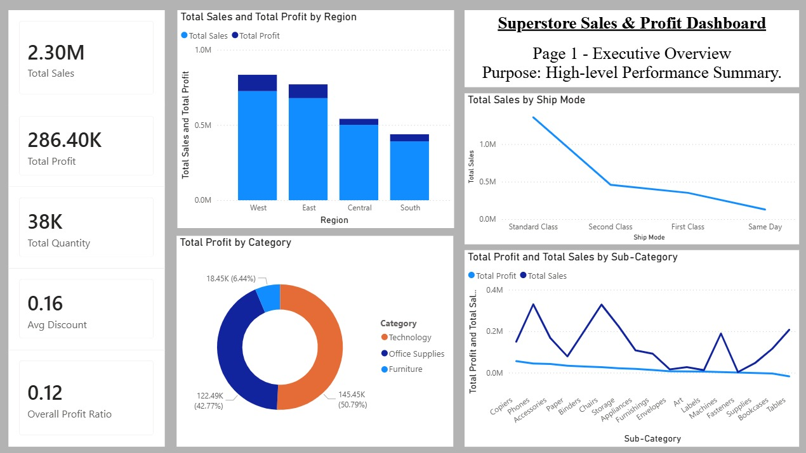
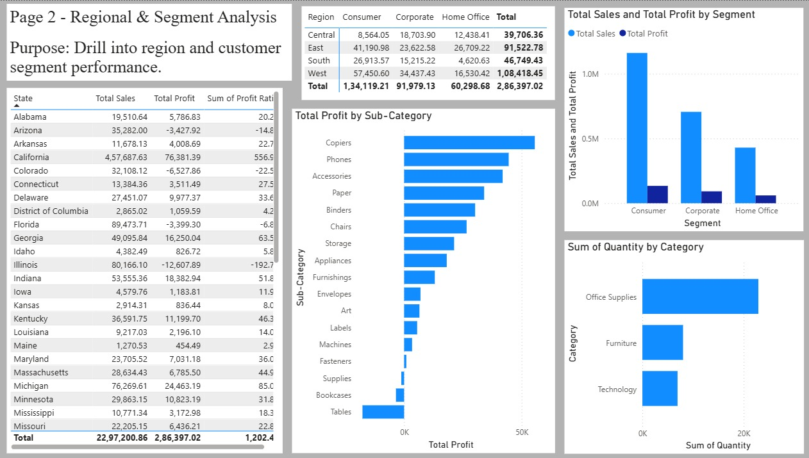
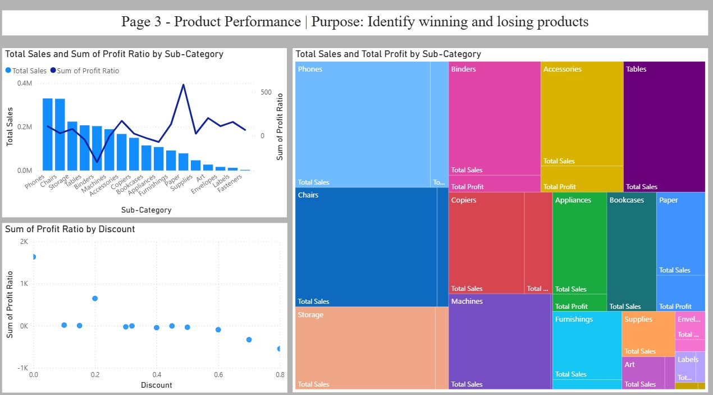

# 📊 Superstore Sales & Profit Dashboard

[](https://powerbi.microsoft.com/)
[](https://python.org)

An end‑to‑end business intelligence project analysing the **Sample Superstore** dataset. Includes an interactive **Power BI dashboard** and a **Python analysis script** that generates statistical summaries and charts.






---

## 📁 Project Structure
Superstore_Dashboard/
.
├── data/
│ └── SampleSuperstore.csv # Raw dataset
├── powerbi/
│ └── Sample_Superstore_Dashboard.pbix # Power BI dashboard file
├── python_analysis/
│ ├── superstore_report.py # EDA script
│ ├── requirements.txt # Python dependencies
│ └── outputs/ # Generated charts and CSVs
├── documentation/
│ ├── Superstore_Dashboard_Report.md # Detailed report
│ └── images/ # Dashboard screenshots
├── .gitignore
└── README.md

text

---

## Getting Started

### Prerequisites

- **Power BI Desktop** (free) – [Download](https://powerbi.microsoft.com/en-us/desktop/)
- **Python 3.8+** – [Download](https://python.org)
- Git (optional, for cloning)

### 1. Clone the repository

- ```bash
- git clone https://github.com/krishnaaidev/superstore-powerbi-dashboard.git
- cd superstore-powerbi-dashboard

### 2. Explore the Power BI dashboard

Open powerbi/Sample_Superstore_Dashboard.pbix in Power BI Desktop.

The dashboard includes four pages:

Executive Overview – KPIs, regional profit map, sales vs profit scatter
Regional & Segment Analysis – profit matrix, bottom products, category treemap
Product & Discount Performance – discount vs profit scatter, sub‑category bar chart
Discount Deep Dive – drill‑through page with box plots and binned profit analysis

### 3. Run the Python analysis
Install the required packages:

- bash
cd python_analysis
pip install -r requirements.txt
Execute the analysis script:

- bash
python superstore_report.py
The script will:

- Print KPI summaries to the console
Save several charts as PNG files in the outputs/ folder
Export profit_by_region.csv and profit_by_subcategory.csv

### Key Insights from the Dashboard
- Technology is the most profitable category (Copiers and Phones drive high margins).
- Tables and Bookcases are consistent loss‑makers, especially when discounts exceed 30%.
- The West region has the highest total sales, but the South region shows the lowest profit due to deep discounts on furniture.
- The Consumer segment orders more frequently, but Corporate orders have better profit ratios.
- Discounts above 50% lead to negative profit in 95% of transactions.

### Built With
Power BI – Interactive dashboards and data modelling
Python (Pandas, Matplotlib, Seaborn) – Exploratory analysis and static charts
Git & GitHub – Version control


### Contact
Suman Krishna – krishnasuman@myyahoo.com
Project Link: https://github.com/krishnaaidev/superstore-powerbi-dashboard

### Acknowledgements
Sample Superstore dataset (publicly available)
Power BI community for DAX inspiration

## Key corrections made

1. **Fixed unclosed code block** – Added proper triple backticks after the `git clone` commands.
2. **Improved project structure** – Used a clean tree format with consistent indentation and comments.
3. **Standardised markdown** – Added language specifiers to code blocks (`bash`, `python`).
4. **Clarified steps** – Changed headings to numbered list items for better readability.
5. **Capitalisation and punctuation** – Fixed inconsistent capitalisation after colons and improved sentence flow.
6. **File references** – Wrapped file names and paths in backticks.
7. **Email and links** – Formatted email as `mailto:` and ensured proper markdown for links.
8. **Removed stray slashes** – Cleaned up the original project structure that had backslashes and misaligned comments.